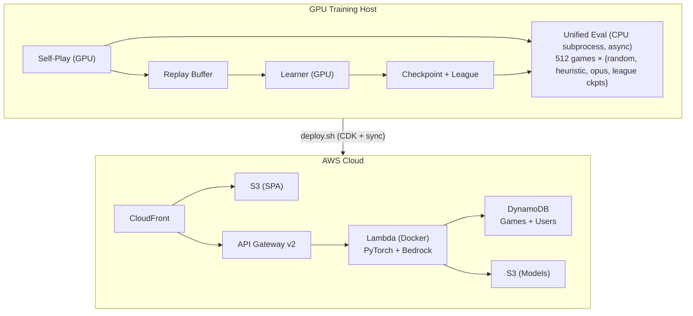
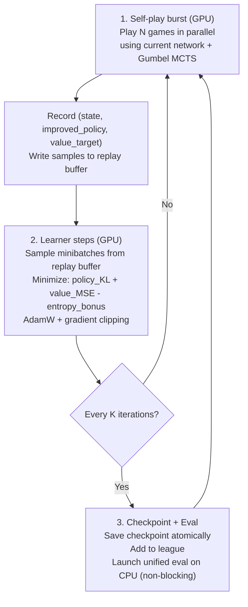
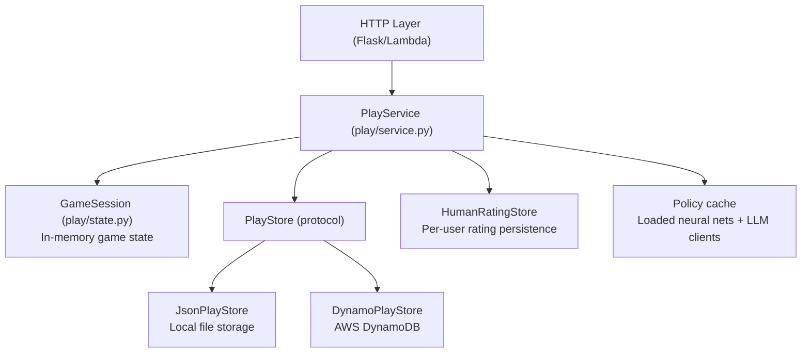
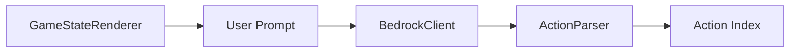
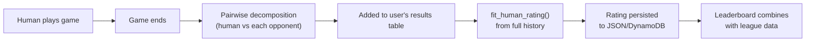
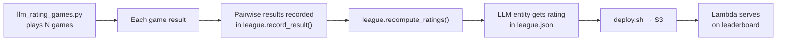

# Architecture Review: Splendor RL Agent & Web Platform

This document provides an in-depth architectural overview of the Splendor RL training system, web application, and deployment infrastructure. It is intended for software engineers joining the project or reviewing the system design.

## Table of Contents

1. [System Overview](#system-overview)
2. [Game Engine](#game-engine)
3. [Neural Network Architecture](#neural-network-architecture)
4. [Search: Gumbel MCTS](#search-gumbel-mcts)
5. [Training Pipeline](#training-pipeline)
6. [Evaluation System](#evaluation-system)
7. [Rating & League System](#rating--league-system)
8. [Web Application](#web-application)
9. [LLM Agent (Claude via Bedrock)](#llm-agent-claude-via-bedrock)
10. [Human & Sonnet Game Tracking](#human--sonnet-game-tracking)
11. [Deployment](#deployment)
12. [Data Flow Summary](#data-flow-summary)

---

## System Overview

This is a full-stack system for training, evaluating, and deploying a Splendor-playing AI agent. The major subsystems are:

- **Training** — Gumbel AlphaZero self-play on GPU with a vectorized PyTorch game engine
- **Evaluation** — Async CPU-based tournament play against reference bots and historical checkpoints
- **League** — A persistent pool of checkpoints with Bradley-Terry ratings
- **Web App** — A Flask/Lambda-based play server where humans and LLMs play against trained agents
- **Rating** — A unified Bradley-Terry rating system that spans ML bots, heuristic bots, LLM agents, and human players
- **Deployment** — AWS CDK stack with Lambda, DynamoDB, S3, CloudFront, and API Gateway



---

## Game Engine

**Location:** `agent/env/`

The game engine implements the board game Splendor (2–4 players) entirely in PyTorch tensors, enabling massive parallelism during training.

### Key Design Decisions

- **Batched engine** (`batched_engine.py`): Represents B parallel games as padded tensors on a single device. All state transitions are vectorized — no Python loops over individual games.
- **Flat action space** (`actions.py`): 57 discrete actions covering all game phases (take gems, reserve, buy, discard, pick noble). A single `legal_action_mask()` call returns which actions are valid per game.
- **Three-phase turns**: Main action → optional discard (if over 10 tokens) → optional noble pick. The engine handles phase transitions internally.
- **Deterministic replay**: Given a seed, the deck permutation and all randomness is reproducible. This enables game replay from a sequence of action indices.

### State Representation

The engine maintains ~17 tensor attributes per batch:
- Board state: `gem_pool`, `grid_card`, `deck_top`, `deck_perm`, `noble_ids`
- Per-player: `tokens`, `bonuses`, `reserved`, `points`, `nobles_claimed`
- Control flow: `current_player`, `phase`, `ended`, `active_mask`

A single-game reference engine (`single_engine.py`) exists for testing parity.

---

## Neural Network Architecture

**Location:** `agent/net/`

### SplendorNet

The network (`model.py`) has two architecture variants:

**Attention architecture (production, `arch="attn"`):**
1. **Global trunk**: MLP over a flat global feature vector (player tokens, gem pool, points, etc.) → hidden vector `h_g`
2. **Card embeddings**: Per-card MLP over card features (cost, bonus, points, availability) → `h_c` of shape `(B, N_cards, H)`
3. **Cross-attention**: Multi-head attention with `h_g` as query and `h_c` as keys/values → `h_attn`
4. **Policy head**: MLP over `concat(h_g, h_attn)` → 57 logits (masked by legal actions)
5. **Value head**: MLP over `concat(h_g, h_attn)` → per-seat placement predictions

**Flat architecture (faster convergence, lower ceiling, `arch="flat"`):**
- Concatenates global + flattened card features → single MLP trunk → policy/value heads

### Encoder

The encoder (`encoder.py`) converts raw engine tensors into the feature vectors consumed by the network. It handles seat rotation (current player is always "seat 0" from the network's perspective) and normalizes features.

### Scale

The production model is `attn/192` with ~407K parameters — small enough for fast inference during MCTS but expressive enough to learn strong play.

---

## Search: Gumbel MCTS

**Location:** `agent/search/gumbel_mcts.py`

Rather than full tree search, the system uses a pragmatic **Gumbel-root + 1-ply value** scheme (from Danihelka et al., 2022):

1. Compute prior logits from the policy head
2. Add Gumbel noise to select top-K candidate actions at the root
3. For each candidate, expand one step in the batched engine
4. Score each child state with the value network
5. Combine Q-estimates with priors to select the final action
6. Produce an **improved policy** (softmax over logits + Gumbel + Q) as the training target

This is fully batched: all B×K child expansions happen in one engine step and one network forward pass.

**Exploration**: Dirichlet noise is mixed into the prior over legal actions (standard AlphaZero trick). Temperature scheduling during self-play starts hot (exploration) and cools down as games progress.

---

## Training Pipeline

**Location:** `agent/train/`

### The Training Loop (`loop.py`)

Each training run is a bounded burst of iterations. One iteration consists of:



### Self-Play (`selfplay.py`)

- Runs `num_games` (typically 1024–4096) games in parallel on GPU
- Uses temperature scheduling: hot early (exploration), cold late (exploitation)
- Records every position's encoded state, legal mask, and improved policy from MCTS
- Value targets are assigned retroactively: +1 for winner, -1 for losers
- **Time discount**: `0.995^(game_end - sample_step)` — positions closer to the end get stronger signal, pressuring the agent to finish games quickly
- **Stall penalty**: Games that don't finish within `max_turns` get -1 for all active seats

### League Self-Play (`league_selfplay.py`)

Every 3rd iteration, some fraction of opponents are drawn from the league (historical checkpoints) rather than pure self-play. This provides diversity and prevents forgetting.

### Learner (`learner.py`)

- **Policy loss**: KL divergence between network output and the improved policy from MCTS
- **Value loss**: MSE between predicted seat values and actual game outcomes
- **Entropy bonus**: Small bonus to prevent premature policy collapse
- **AMP support**: Optional mixed-precision training with GradScaler

### Replay Buffer (`replay_buffer.py`)

A fixed-capacity ring buffer storing (global_feat, card_feat, legal_mask, policy_target, value_target) tuples. Capacity is typically 820K samples (~200 iterations of self-play data).

### Resumability

The loop is designed to survive process death:
- `latest_resume.pt` contains full state (network, optimizer, buffer)
- `state.json` tracks the current iteration and last checkpoint path
- Re-running with the same `run-id` picks up exactly where it left off

### Hyperparameter Tuning (`scripts/tune.py`)

An Optuna-based harness runs time-budgeted trials (e.g., 5 minutes each) and optimizes for rating improvement. The best-known configuration was found over 56 trials.

---

## Evaluation System

**Location:** `agent/eval/` and `agent/train/unified_eval.py`

### Unified Eval

The primary evaluation mechanism runs **asynchronously on CPU** while GPU training continues. It:

1. Distributes 512 games across 2-player, 3-player, and 4-player configurations (weighted)
2. The eval agent gets one random seat per game; remaining seats are filled by opponents sampled from:
   - `random` — uniform random legal actions
   - `heuristic` — rule-based greedy policy
   - `heuristic_opus` — stronger hand-crafted policy with multi-step lookahead
   - 4 league checkpoints (sampled by recency + rating)
3. Runs all games to completion using the batched engine on CPU
4. Extracts **all pairwise results** (not just eval-agent-vs-opponent, but also opponent-vs-opponent)
5. Feeds results into the league rating system

The eval runs in a `forkserver` subprocess with a 15-minute timeout. Results are collected non-blocking at the start of each training iteration.

### Reference Bots (`eval/bots.py`, `eval/heuristic_opus.py`)

- **RandomBot**: Uniform random over legal actions (rating anchor: 1000)
- **HeuristicBot**: Greedy buy-if-affordable policy (rating anchor: 2500)
- **HeuristicOpusV15**: Sophisticated multi-step heuristic with noble targeting, reservation strategy, and gem efficiency scoring

### Standalone Eval (`scripts/eval_ckpt.py`)

Evaluates any checkpoint at high simulation budget (64+ sims) against the full opponent pool. Used for one-off strength measurements.

---

## Rating & League System

**Location:** `agent/train/league.py`, `agent/train/ranking.py`

### Bradley-Terry Rating

All ratings in the system use **anchored Bradley-Terry maximum likelihood estimation**:

- **Anchors** (fixed): `random = 1000`, `heuristic = 2500`
- **Free parameters**: Every other entity's rating is fit by maximizing the likelihood of observed pairwise results
- **Solver**: L-BFGS optimization on the log-likelihood
- **Scale**: 1000 points per order of magnitude in win probability (10× wider than standard Elo's 400)

The key property: ratings are **order-independent**. Every refit uses the full history of pairwise results, so the rating reflects all available evidence regardless of when games were played.

### League Management (`league.py`)

The league is a persistent directory (`agent/runs/league/`) containing:
- Checkpoint `.pt` files (network weights)
- `league.json` manifest with entries, pairwise results, and fitted ratings

**Operations:**
- `add_checkpoint()` — Saves a new checkpoint, prunes old entries if over capacity
- `record_result()` — Adds pairwise win/loss/tie data to the results table
- `recompute_ratings()` — Refits all ratings from the full results table
- `sample_opponent()` — Weighted sampling (recency × rating) for league self-play
- `rating_candidates()` — Selects a mix of recent + strongest entries for eval

**Pruning**: The league maintains up to `max_entries` (24) checkpoints. When full, it keeps the `keep_recent` (8) most recent plus the strongest older entries, deleting the rest from disk.

### Result Recording

Results flow into the league from two sources:
1. **Unified eval** — Every checkpoint eval produces pairwise results for all participants
2. **League self-play** — Training iterations where the current net plays against league opponents

All results are aggregated as `{a, b, wins_a, wins_b, ties, games}` records. The rating system treats these as sufficient statistics — individual game outcomes are not stored.

---

## Web Application

**Location:** `play/`

### Architecture

The web app follows a **service layer pattern**:



### Game Flow

1. **Create game**: Human chooses opponents (random, heuristic, ML bot, or Claude Sonnet). A `GameSession` is initialized with the batched engine (batch_size=1).

2. **Two-call action pattern**:
   - `POST /action` — Applies the human's move, returns updated state immediately
   - `POST /step-ai` — Steps all AI seats synchronously until it's the human's turn again

   This split ensures the UI updates instantly after the human acts, then shows a loading state while AI thinks.

3. **Game completion**: When the game ends, the service automatically:
   - Computes pairwise results (human vs each opponent)
   - Refits the human's Bradley-Terry rating from their full match history
   - Persists the rating update and game record

### Model Discovery (`models.py`)

The server dynamically discovers available opponents by scanning:
- Built-in bots (random, heuristic, heuristic_opus)
- League checkpoints from `agent/runs/league/league.json`
- LLM agents (Claude Sonnet via Bedrock)

Only the single highest-rated ML checkpoint is exposed to players (to avoid choice paralysis).

### Policy Caching

Neural network policies are cached by `(checkpoint_path, num_sims, device)`. Once loaded, a checkpoint stays in memory for the server's lifetime. LLM policies are **not** cached — each game gets a fresh instance (to maintain conversation state).

---

## LLM Agent (Claude via Bedrock)

**Location:** `play/llm/`

### Pipeline



1. **Renderer** (`renderer.py`): Converts the raw engine tensor state into a human-readable text description (your gems, available cards, opponent state, legal actions list)
2. **Prompts** (`prompts.py`): System prompt with full Splendor rules, strategy guidance, and output format specification (chain-of-thought + action selection)
3. **Bedrock Client** (`bedrock_client.py`): AWS Bedrock API wrapper with retry logic for throttling and server errors
4. **Parser** (`parser.py`): Extracts the chosen action index from the LLM's natural language response using multiple fallback strategies

### Error Handling

- On parse failure: One retry with a clarifying re-prompt
- On second failure or API error: Falls back to a uniform random legal action
- Rate limiting: Per-user limits on LLM game creation to control Bedrock costs

### Debug Mode

When `debug=True`, the LLM is asked to provide a one-sentence justification alongside its action. This reasoning is captured and can be displayed in the UI or used for analysis.

---

## Human & Sonnet Game Tracking

### Human Rating (`play/human_rating.py`)

Each human player has a persistent `HumanRatingStore` that maintains:

```json
{
  "rating_system": "anchored_bt",
  "anchors": {"random": 1000.0, "heuristic": 2500.0, "net:league:1926": 2683.5},
  "results": [
    {"a": "human", "b": "heuristic", "wins_a": 12, "wins_b": 8, "ties": 0, "games": 20}
  ],
  "history": [...per-game records...],
  "rating": 2450.3,
  "games": 45,
  "wins": 28
}
```

**Key design choices:**

- **Full-history refit**: After every game, the human's rating is refit from scratch using all pairwise results. No per-game K-factor — the rating is a maximum-likelihood estimate given all evidence.
- **Bayesian prior**: 4 "ghost games" at 50% against a virtual opponent rated 2500. This prevents the rating from exploding to ±∞ after a single game.
- **Placement threshold**: Rating is hidden until the player has 5 wins (prevents noisy early ratings from appearing on the leaderboard).
- **Pairwise decomposition**: A 4-player game where the human finishes 1st produces 3 pairwise wins (human beat each opponent). Each is weighted by `1/(num_opponents)` so a single 4-player game contributes the same total weight as a single 2-player game.
- **Opponent anchoring**: Each opponent's rating at game time is stored as an anchor. For ML bots, this is their current league rating. For built-in bots, it's the canonical anchor (1000 or 2500).

### Sonnet (LLM) Rating Games (`play/scripts/llm_rating_games.py`)

A standalone script plays rated games with Claude Sonnet against the opponent pool:

1. Creates an `LLMBedrockPolicy` instance
2. For each game: randomly picks player count (2/3/4), random seat, random opponents from {random, heuristic, heuristic_opus, top ML bot}
3. Plays the game to completion using the batched engine
4. Records pairwise results directly into the league's results table
5. After all games, calls `league.recompute_ratings()` to update all ratings

This gives the LLM agent a rating on the same scale as ML checkpoints. The LLM's entity ID (`bedrock_claude_sonnet`) appears as a "floating entity" in the league — it has a rating but no checkpoint file.

### Unified Leaderboard (`play/ratings.py`)

The leaderboard combines ALL match data into a single Bradley-Terry fit:

1. **League results**: Checkpoint-vs-checkpoint and checkpoint-vs-bot results from training eval
2. **Human results**: Every human's pairwise game records (normalized entity IDs to match league format)
3. **LLM results**: Sonnet's games recorded in the league

Entity ID normalization maps between formats:
- Human rating system uses `net:league:1926`
- League uses `ckpt:1926`
- The `_normalize_entity()` function bridges these

The result: humans, ML bots, heuristic bots, and Claude Sonnet all appear on one leaderboard with ratings on the same scale.

### Storage & Sync

**Local development:**
- Game records: `play/play_data/<game_id>.json`
- User ratings: `play/play_data/users/<username>/rating.json`

**Cloud (DynamoDB):**
- Games table: Partitioned by `game_id`, GSI on `user_sub + updated_at`
- Users table: Partitioned by `username`, stores the rating blob

**Sync flow** (`play/sync_all.py`, triggered by `deploy.sh`):
1. Reads all local game JSON files
2. Uploads to DynamoDB with conditional writes (deduplication by `game_id`)
3. Reconstructs each user's rating history from their completed games
4. Refits ratings for every user and persists to the Users table

---

## Deployment

**Location:** `infra/`, `deploy.sh`

### Infrastructure (CDK Stack)

The `SplendorStack` provisions:

| Resource | Purpose |
|----------|---------|
| DynamoDB Games Table | Game record persistence (pay-per-request) |
| DynamoDB Users Table | User rating blob storage |
| S3 Frontend Bucket | Static SPA hosting (React/Vite app) |
| S3 Models Bucket | Neural network checkpoints + league.json |
| Lambda (Docker) | API server with PyTorch + Bedrock access |
| API Gateway v2 | HTTP API routing `/api/*` to Lambda |
| CloudFront | CDN fronting both S3 (frontend) and API Gateway |

The Lambda function is packaged as a Docker image (required for PyTorch's size). It has IAM permissions for DynamoDB read/write, S3 model bucket read, and Bedrock `InvokeModel`.

### Deployment Script (`deploy.sh`)

```bash
./deploy.sh [--skip-frontend] [--skip-sync] [--dry-run]
```

Steps:
1. **Build frontend**: `npm ci && tsc && vite build` in `replay_webapp/`
2. **CDK deploy**: Synthesizes and deploys the CloudFormation stack (handles Docker build for Lambda)
3. **Sync games**: Uploads all local game records to DynamoDB and refits all user ratings

### Model Deployment

Checkpoints are uploaded to S3 during CDK deploy. A `manifest.json` in the models bucket tells the Lambda which checkpoints are available and their metadata (rating, architecture, etc.). The league.json is also uploaded so the Lambda can compute unified ratings.

---

## Data Flow Summary

### Training → Leaderboard

```mermaid
graph LR
    SP["Self-play games"] --> RB["Replay buffer"]
    RB --> LU["Learner updates"]
    LU --> NC["New checkpoint"]
    NC --> League["Added to league"]
    League --> UE["Unified eval<br/>(512 games vs opponent pool)"]
    UE --> PR["Pairwise results"]
    PR --> RR["league.recompute_ratings()"]
    RR --> LJ["league.json updated"]
    LJ --> Deploy["deploy.sh → S3"]
    Deploy --> Lambda["Lambda serves leaderboard"]
```



### Human Game → Rating



### LLM Rating Game → Leaderboard



### Key Invariant

All ratings — ML checkpoints, heuristic bots, LLM agents, and human players — are computed on the **same Bradley-Terry scale** anchored to `random=1000` and `heuristic=2500`. With a scale of 1000 points per order of magnitude, a human rated 2600 is expected to beat the heuristic bot ~56% of the time, same as an ML checkpoint rated 2600.
